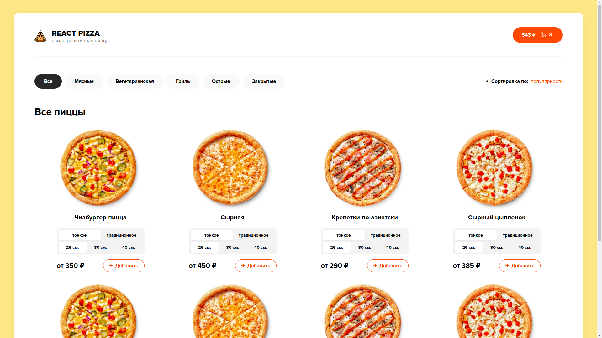

## The website of the pizzeria

### `yarn`

To install all dependencies for a project

### `yarn start`

Runs the app in the development mode. 
Open [http://localhost:3000](http://localhost:3000) to view it in the browser.

The page will reload if you make edits. 
You will also see any lint errors in the console.

## Main page

## 
